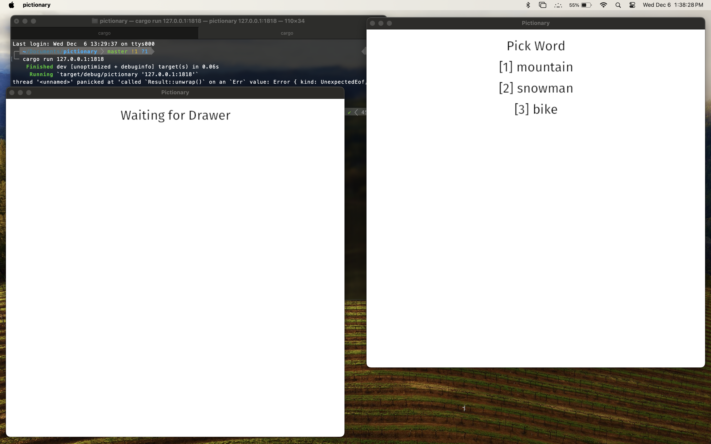
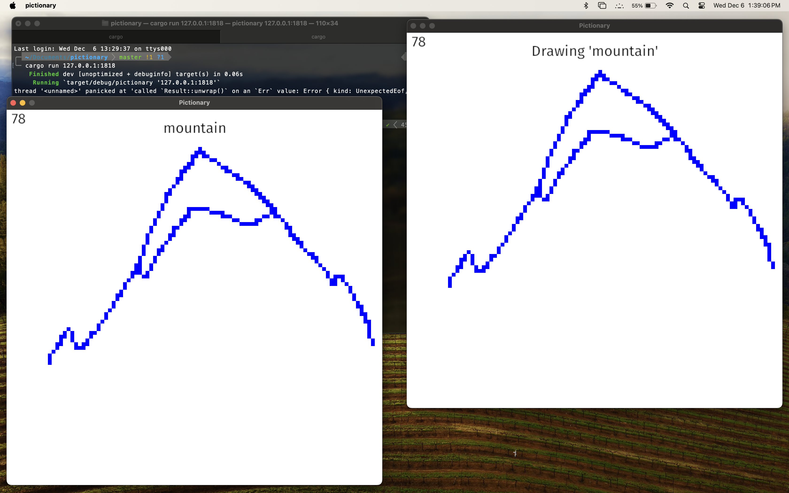
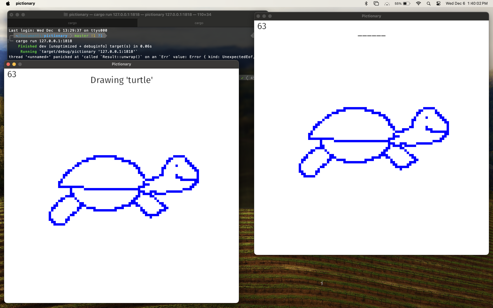

# Pictionary
Simple TCP-based pictionary application implemented in Rust.

## Usage
To play, you'll need two applications running. The first application needs to be run first; specify the IP address to use along with the port, and add "true" at the end to indicate that this instance is the host. Ex: "cargo run -- 0.0.0.0:1818 true".   
  
For the second player, the only argument should be the socket address to connect to. Ex: "cargo run -- 127.0.0.1:1818".

